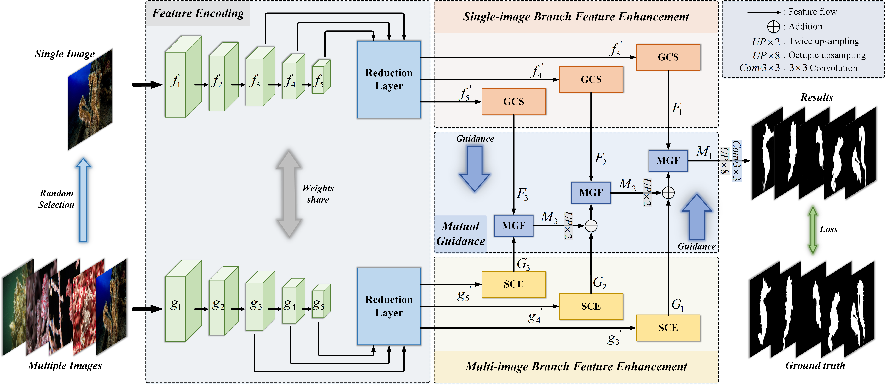

# 
`Mutually-Guided Fusion Learning for Collaborative Camouflaged Object Segmentation `

MFRNet Official Implementation of "[Mutually-Guided Fusion Learning for Collaborative Camouflaged Object Segmentation]()"

## Training/Testing
The training and testing experiments are conducted using PyTorch with a single GeForce NVIDIA GTX 3090Ti of 24 GB Memory.

1. Prerequisites:

 + Creating a virtual environment in terminal: `conda create -n MFRNet python=3.6`.
 +  Installing necessary packages: torch==1.10.0, torchvision==0.11.0, cudatoolkit==11.3.0.

2. Prepare the data:
   + downloading testing dataset and moving it into `./Dataset/TestDataset/`.
    + downloading training/validation dataset and move it into `./Dataset/TrainDataset/`.
    + downloading Res2Net weights on ImageNet dataset [download link](https://pan.quark.cn/s/617987709421) or [Google Drive](https://drive.google.com/file/d/19pc0FTm_l74kot9dhk3mN7mTJd77N7Og/view?usp=sharing).
    + CoCOD8K can be download from [here](https://github.com/zc199823/BBNet--CoCOD?tab=readme-ov-file#3-proposed-framework).
    + CAMO、CHAMELEON、COD10K can be download from [here](https://github.com/GewelsJI/SINet-V2).
    + NC4K can be download from [here](https://github.com/JingZhang617/COD-Rank-Localize-and-Segment). 
3. Training Configuration:

    + Assigning your costumed path, like `--train_save` and `--train_path` in `my_train.py`.
    
    + Just enjoy it via run `python my_train.py` in your terminal.
4. Testing Configuration:

    + After you download all the pre-trained models and testing datasets, just run `test.py` to generate the final prediction map: 
    replace your trained model directory (`--pth`).
    + Just enjoy it!

## Our Weights and Results

1. Weights based on Res2Net50 backbone:

    https://pan.baidu.com/s/1aoEzvgCfiY96kmzZ6i_krw   code: 6a4r 

2. Results:

   - When MFRNet uses Res2Net50 Backbone, the comparison of results are:

     https://pan.baidu.com/s/1AFJWMo5D0-rGsZiFjiMvww   code: 2b88 

   - When MFRNet uses Tranformer Backbone, the comparison of results are:

     https://pan.baidu.com/s/1x-eyKS-xWHf8fOs9FiJKRg   code: x8u5 

## Citation

If you find this project useful, please consider citing:
    
    @article{li2026mutually,
    title={Mutually-Guided Fusion Learning for Collaborative Camouflaged Object Segmentation},
    author={Li, Chen and Luan, Xiao and Liu, Linghui and Su, Yanzhao and Fu, Yule and Li, Weisheng},
    journal={IEEE Transactions on Neural Networks and Learning Systems},
    volume={37},
    number={6},
    pages={2644-2657},
    year={2026},
    doi={10.1109/TNNLS.2025.3636523}
    }

